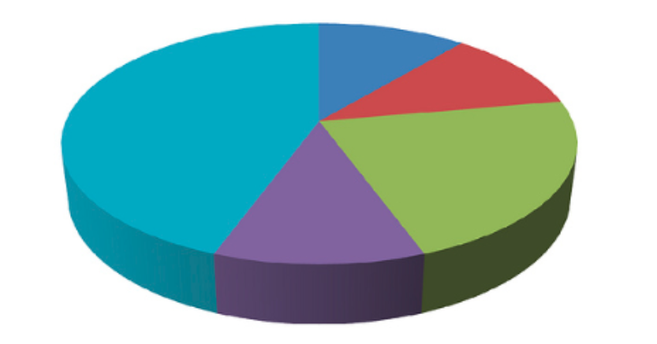

```{r setup, include=FALSE}
options(htmltools.dir.version = FALSE)
```

# Wizualizacja statystyczna

## Wykresy eksploracyjne

- służą głównie dla ich twórcy
- kluczową ich cechą jest możliwość iteracji

## Wykresy komunikacyjne

- służą głównie przekazaniu wiedzy
- ich stworzenie wymaga czasu
- ważny jest dobór podpisów, kolorów, etc.

---
# Wykresy a R

## Wykresy w R
- Istnieje wiele różnych możliwości tworzenia wykresów w R
- Najczęściej używane to **podstawowe grafiki**, pakiet **lattice** oraz pakiet **ggplot2**

---
## ggplot2 

```{r, eval=FALSE}
install.packages("ggplot2")
```

```{r}
library('ggplot2')
```

---
## ggplot2 - pierwszy wykres

```{r, fig.align='center',fig.height=4}
df <- data.frame(zmiennaA = c(1:10), zmiennaB = seq(22, 4, by= -2))
ggplot(data=df, aes(x=zmiennaA, y=zmiennaB)) + geom_point()
```

---
## ggplot2 - podstawowe informacje

- pakiet jest implementacją założeń zawartych w książce "Grammar of Graphics" Lelanda Wilkinsona
- data.frame jest zazwyczaj wymaganymi danymi wejściowymi
- istnieją dwie komendy pozwalające na tworzenie wykresów - *qplot* oraz *ggplot*
- pełna dokumentacja znajduje się na stronie - http://docs.ggplot2.org

---
## ggplot2 - podstawowe słownictwo

- **geom** - oznacza typ wykresu (np. "histogram", "boxplot", "point", etc.)
- aesthetics (**aes**) - oznacza kształt, kolor, wielkość, etc.
- faceting (**facet**) - oznacza wykresy dla podzbiorów

---
## Zbiór danych

```{r, eval=FALSE}
install.packages('devtools')
devtools::install_github("jennybc/gapminder")
library(gapminder)
```

lub

```{r}
gapminder <- readRDS('data/gapminder.rds')
```

http://www.gapminder.org/data/

http://github.com/jennybc/gapminder

http://www.youtube.com/watch?v=jbkSRLYSojo

```{r}
gapminder2007 <- subset(gapminder, year==2007)
```

---
## Histogram

.pull-left[
- stworzony przez Karla Pearsona
- jest graficzną reprezentacją rozkładu <br> danych
- wartości danych są łączone w przedziały (na osi poziomej) a na osi pionowej jest ukazana liczba punktów (obserwacji) w każdym przedziale
- różny dobór przedziałów może dawać inną informację
- w pakiecie ggplot2, przedział to domyślnie zakres/30
]

.pull-right[
```{r, tidy=FALSE, message=FALSE, out.width =  '400px'}
ggplot(data=gapminder2007, aes(x=gdpPercap)) + 
        geom_histogram()
```
]

---
## Histogram 

.pull-left[
```{r, tidy=FALSE, message=FALSE, warning=FALSE, out.width =  '400px'}
ggplot(data=gapminder2007, aes(x=gdpPercap)) + 
        geom_histogram(binwidth=10000)
```
]

.pull-right[
```{r, tidy=FALSE, message=FALSE, warning=FALSE, out.width =  '400px'}
ggplot(data=gapminder2007, aes(x=gdpPercap)) + 
        geom_histogram(binwidth=800)
```
]

---
## Wykres słupkowy
```{r, fig.align='center',fig.height=4}
ggplot(data=gapminder2007, aes(x=continent)) + geom_bar()
```


---
## Wykres liniowy 
```{r, fig.align='center',fig.height=4, message=FALSE, warning=FALSE}
library('dplyr')
gapminder2 <- gapminder %>% group_by(year) %>% summarise(mean.lifeExp=mean(lifeExp, na.rm=TRUE))
ggplot(data=gapminder2, aes(x=year, y=mean.lifeExp)) + geom_line()
```

---
## Wykres rozrzutu

```{r, fig.align='center',fig.height=4}
ggplot(data=gapminder2007, aes(x=gdpPercap, y=lifeExp)) + geom_point()
```

---
## Wykres pudełkowy 

.pull-left[
- obrazuje pięc podstawowych <br> statystyk opisowych oraz wartości odstające
- pudełko to zakres międzykwantylowy
- linie oznaczają najbardziej ekstremalne wartości, ale nie odstające. Górna to 1,5\*IQR ponad krawędź pudełka, dolna to 1,5\*IQR poniżej wartości dolnej krawędzi pudełka
- linia środkowa to mediana
]

.pull-right[
```{r,fig.height=4, fig.width=4}
ggplot(data=gapminder2007, aes(x=continent, y=lifeExp)) +
        geom_boxplot()
```
]

---
## Wykresy, a dane ilościowe i jakościowe

- kolory
- kształty
- wielkości

---
## Wykresy, a dane ilościowe (1)

```{r, fig.align='center',fig.height=4.5}
ggplot(data=gapminder2007, aes(x=gdpPercap, y=lifeExp, color=pop)) + geom_point()
```

---
## Wykresy, a dane ilościowe (2)

```{r, fig.align='center',fig.height=4.5}
ggplot(data=gapminder2007, aes(x=gdpPercap, y=lifeExp, size=pop)) + geom_point()
```

---
## Wykresy, a dane jakościowe (1)

```{r, fig.align='center',fig.height=4.5}
ggplot(data=gapminder2007, aes(x=gdpPercap, y=lifeExp, color=continent)) + geom_point()
```

---
## Wykresy, a dane jakościowe (2)

```{r, fig.align='center',fig.height=4.5}
ggplot(data=gapminder2007, aes(x=gdpPercap, y=lifeExp, shape=continent)) + 
        geom_point()  + scale_shape(solid = FALSE)
```

---
## Modyfikacja wykresów

```{r, tidy=FALSE, message=FALSE, warning=FALSE, fig.align='center', fig.height=4}
p <- ggplot(data=gapminder2007, aes(x=lifeExp, fill=continent)) +
        geom_histogram() + xlab('Oczekiwana dalsza długość trwania życia') + ylab(NULL)
p <- p + ggtitle('Histogram') + labs(fill = "Kontynent")
p
```

---
## Zapisywanie wykresów

```{r, tidy=FALSE, message=FALSE, eval=FALSE}
p <- ggplot(data=gapminder2007, aes(x=lifeExp, fill=continent)) + 
        geom_histogram() + xlab('Oczekiwana dalsza długość trwania życia') + ylab(NULL)
p <- p + ggtitle('Histogram') + labs(fill = "Kontynent")
```

```{r, tidy=FALSE, message=FALSE, eval=FALSE}
ggsave(filename = "Wykres.pdf", plot = p)
```

```{r, tidy=FALSE, message=FALSE, eval=FALSE}
ggsave(filename = "Wykres.png", plot = p, dpi = 300)
```

---
## Inne

- Kolejne typy wykresów (inne *geomy*)
- Przekształanie danych na wykresach (np. *scale_x_log10*)
- Multiwykresy (*facet_grid*, *facet_wrap*, itd.)
- Modyfikacja wyglądu (motywów - *theme*)
- Przedstawiane danych przestrzennych
- Wiele innych...

---

<iframe src="http://shiny.stat.ubc.ca/r-graph-catalog/"></iframe>

---
## Kilka porad

- nie redukuj!
- nie stosuj wykresów kołowych
- nie stosuj wykresów 3D
- uważaj na osie
- nie stosuj dwóch osi

---

<h2>In a sense, it might be construed as an insult to a man's intelligence to show him a pie chart.</h2> <div style="text-align:right;"> 
<h4>K.G. Karsten (1923)</h4>
</div>

<h2>There is no data that can be displayed in a pie chart, that cannot be displayed BETTER in some other type of chart.</h2> <div style="text-align:right;"> 
<h3>John Tukey (?)</h3>
</div>

<h2>A table is nearly always better than a dumb pie chart.</h2> <div style="text-align:right;"> 
<h3>E. Tufte (2001)</h3>
</div>


---

<div style='text-align: center;'> </div>

Odnośniki:

- [Should You Ever Use a Pie Chart?](http://priceonomics.com/should-you-ever-use-a-pie-chart/)
- [The 60 Silliest Pie Charts on the Internet](http://twentytwowords.com/ultimate-list-of-funny-pie-charts)

--- 

Resources:

- http://varianceexplained.org/RData/lessons/lesson2/
- http://www.njtierney.com/Resources/